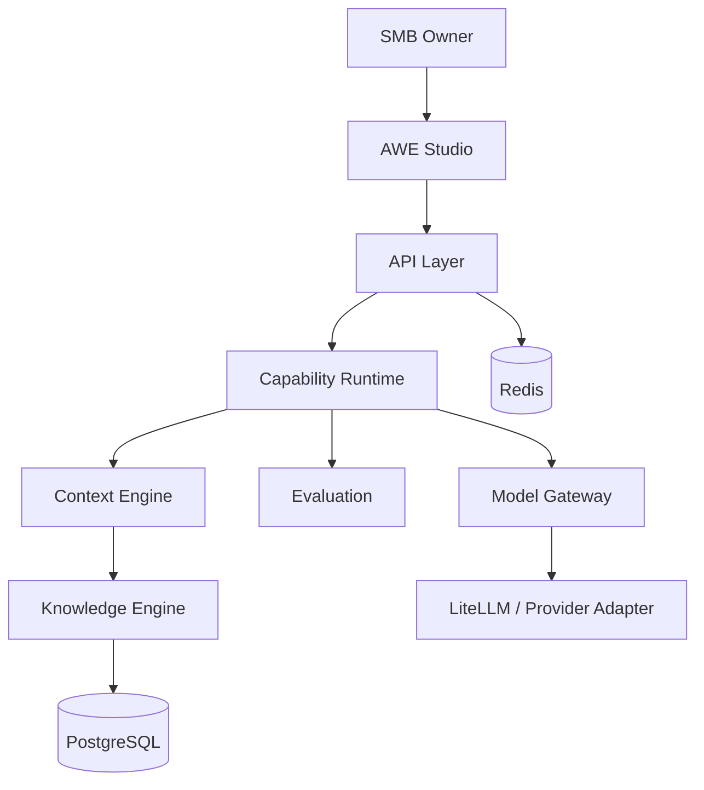
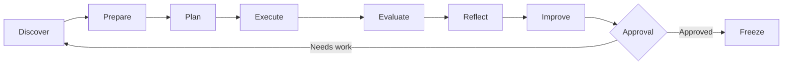

# AWE Architecture — Genesis

## Architectural stance

AWE is API-first, capability-driven, knowledge-first and model-agnostic.

## MVP simplification

Genesis intentionally avoids:
- a graph database
- a distributed workflow engine
- autonomous multi-agent swarms
- multi-framework website output
- deployment automation

Those may be introduced only when implementation evidence justifies them.

## AI loop

