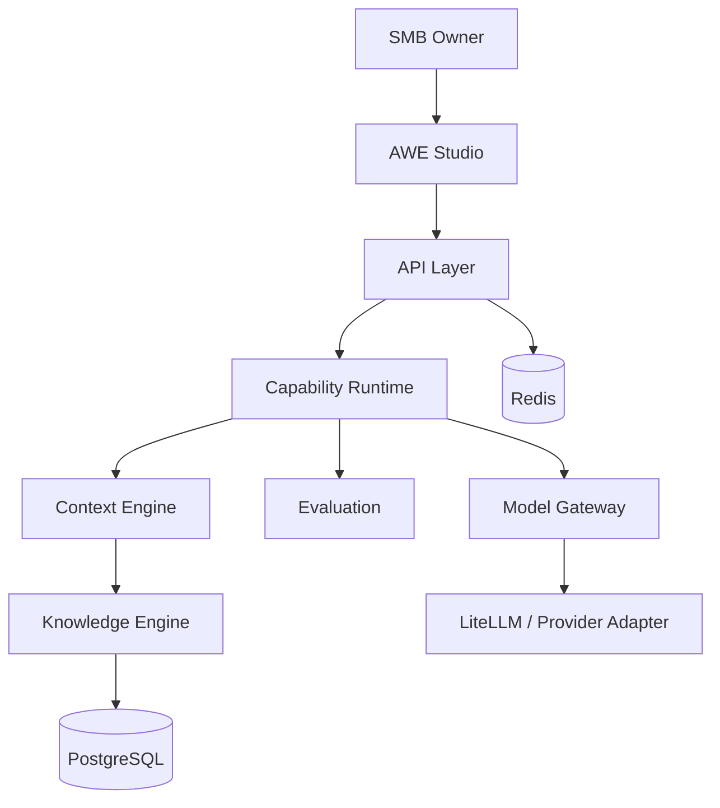
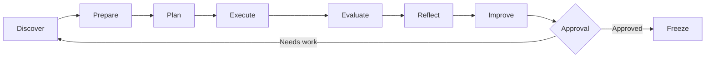

# AWE Architecture — Genesis

## Architectural stance

AWE is API-first, capability-driven, knowledge-first and model-agnostic.

## MVP simplification

Genesis intentionally avoids:
- a graph database
- a distributed workflow engine
- autonomous multi-agent swarms
- multi-framework website output
- deployment automation

Those may be introduced only when implementation evidence justifies them.

## AI loop

## CAP-036 FIX-31 — Deployment identity is a live-preview navigation boundary

The live deployment architecture distinguishes **project-level canonical resolution** from **deployment-level identity**. A project URL without a deployment ID resolves the latest successful deployed version. Once a deployment is selected, the browser must remain inside `/api/live-preview/deployment/<project-id>/<deployment-id>/...` for all generated pages and resources.

The deployment ID is therefore a durable logical identity; the Docker runtime ID and host port are disposable implementation details. Historical deployments can be restored from `awe-deployment-<deployment-id>` without becoming canonical and without stopping the current live deployment. Generated HTML and Next.js navigation state are rewritten at the deployment proxy boundary so navigation cannot silently fall back to the latest deployment.

This invariant prevents a historical deployment from rendering one version on first load and another version after client-side navigation. See `docs/adr/ADR-0019-deployment-pinned-live-preview.md` and `docs/cap-036-fix-31-deployment-pinned-live-preview.md` for the decision, evidence and regression contract.

## CAP-037 — Deployment lifecycle and current/previous policy

Deployment identity is durable and independent from runtime identity. Each
successful deployment has an immutable deployment ID/version and an observable
`snapshot_ref` (`awe-deployment-<deployment-id>` for the local provider).
`lifecycle_role` is authoritative for product currentness:

- `current`: exactly one per project, enforced by a PostgreSQL partial unique index;
- `previous`: the immediately superseded successful deployment;
- `historical`: older or non-canonical successful deployments.

`status` remains the deployment-operation/runtime compatibility field and is not
used as the sole definition of currentness. Stopping a runtime therefore does
not erase or change deployment identity. A current deployment can be recreated
from its snapshot.

Promotion is atomic and happens only after snapshot persistence and a healthy
deployment runtime. Failed deployments never demote the existing current
deployment. The local provider reconciles warm deployment runtimes to the
current + immediately previous policy and leaves older deployments
snapshot-backed/restorable.

The CAP-036 deployment-pinned browser namespace remains mandatory:
`/api/live-preview/deployment/<projectId>/<deploymentId>/...`. Explicit
deployment URLs always resolve to that deployment; opening/restoring a
historical deployment is never a promotion operation.

## CAP-038.1 — Stable URL boundary and endpoint layering

Studio control-plane API calls and live-content proxy traffic are separate architectural paths. Deployment CRUD/history calls go from the Studio React client directly to the canonical FastAPI `/api/v1/deployments...` contracts via `NEXT_PUBLIC_API_URL` and normal auth/scope/resource authorization. Generated live website traffic uses the product-facing `/api/live/<project>/...` or `/api/live/<project>/deployment/<deployment>/...` Studio routes, which delegate privately to `/api/v1/website-preview/live-proxy/...` with the internal proxy secret. FIX-31 `/api/live-preview/deployment/...` routes are retained only as compatibility aliases. See `docs/cap-038-endpoint-contract.md`.
