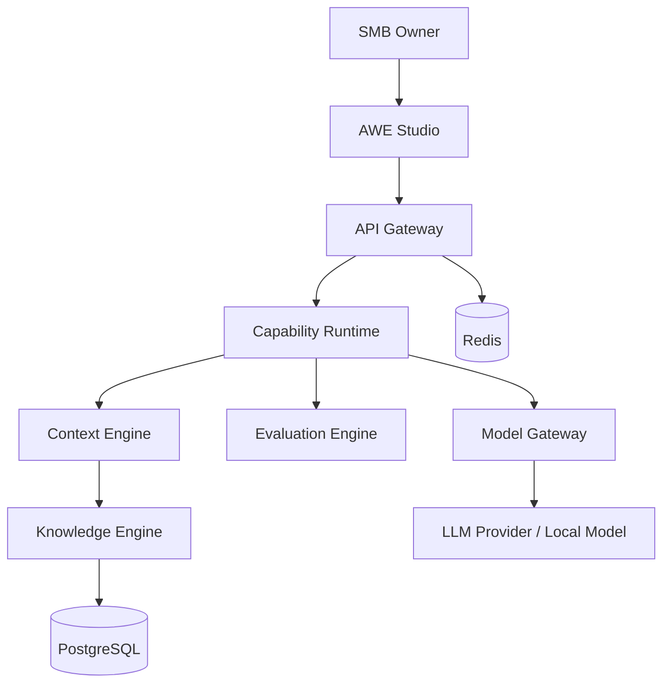

# Miro-Compatible Architecture Map

Copy the following Mermaid diagram into a Mermaid-compatible Miro workflow or use it as the source for native Miro shapes.

```mermaid
flowchart TB
  USER[SMB Owner]
  STUDIO[AWE Studio]
  API[API Gateway]
  CAP[Capability Runtime]
  CTX[Context Engine]
  KNOW[Knowledge Engine]
  EVAL[Evaluation Engine]
  MODEL[Model Gateway]
  DATA[(PostgreSQL)]
  CACHE[(Redis)]
  PROVIDER[LLM Provider / Local Model]

  USER --> STUDIO
  STUDIO --> API
  API --> CAP
  CAP --> CTX
  CTX --> KNOW
  CAP --> EVAL
  CAP --> MODEL
  KNOW --> DATA
  API --> CACHE
  MODEL --> PROVIDER
```
